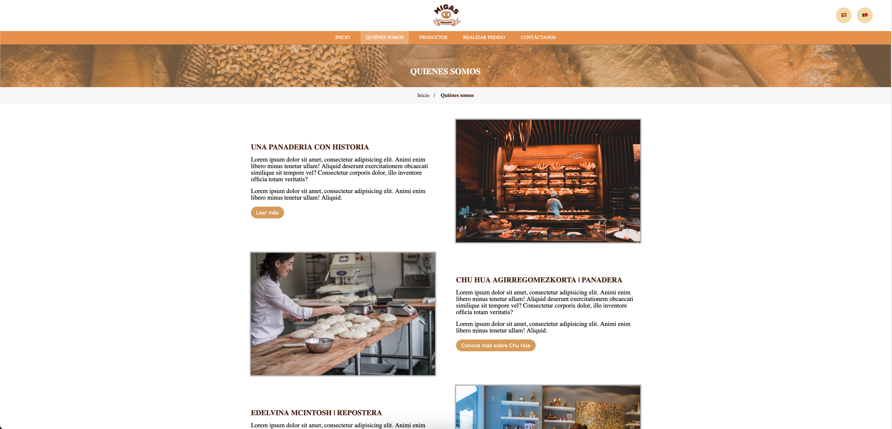
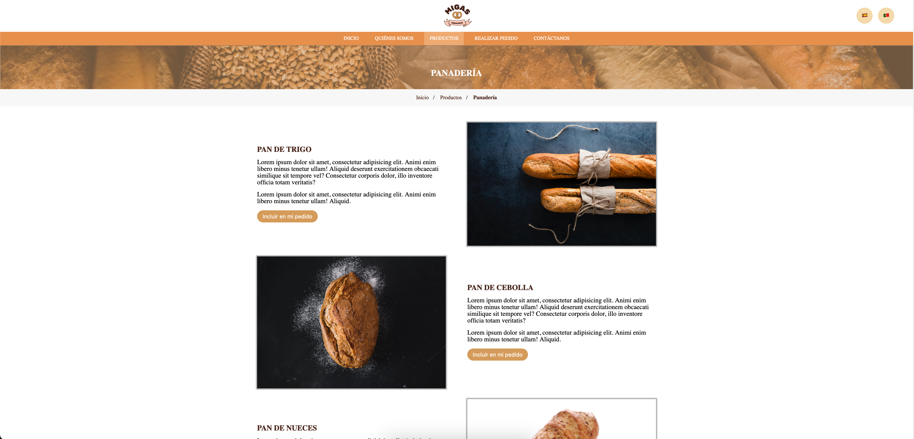
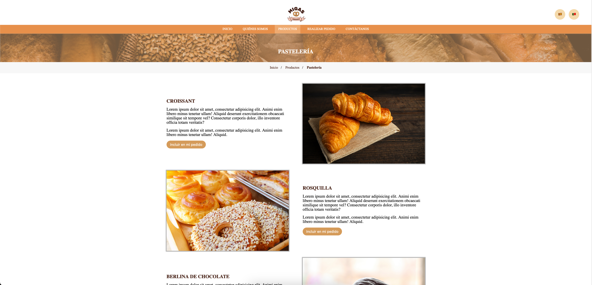

# 🥖 Migas Hermanas

**Migas Hermanas** is a mockup project for a local bakery website.  
The design emphasizes simplicity, warmth, and a welcoming user experience, built using **HTML5**, **CSS3**, and **Sass**.

## ✨ Technologies Used

- HTML5
- CSS3
- JavaScript
- Sass (Syntactically Awesome Stylesheets)
- Internationalization (i18n)

## 📸 Screenshots

  
   
  
  

